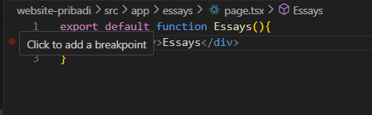
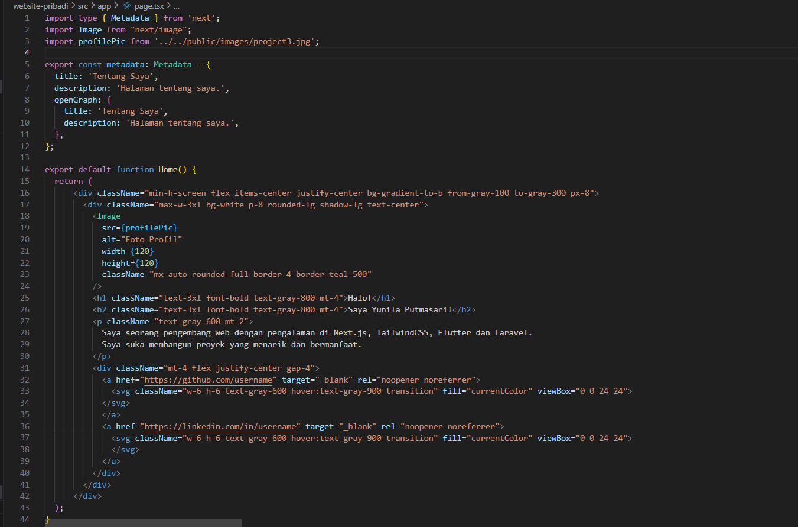

### Membangun Website Pribadi dengan Next.js (App Router), React, dan Tailwind CSS

1. Pastikan Node.js dan npm sudah terinstal di komputer Anda. Anda dapat memeriksanya dengan menjalankan perintah berikut di terminal atau command prompt:
node -v 

npm -v 

2. Buat direktori baru untuk proyek Next.js Anda:
mkdir website-pribadi 

cd website-pribadi 

3. Inisialisasi proyek Next.js dengan TypeScript dan App Router:
npx create-next-app@latest . --typescript –app 

4. Cek konfigurasi postcss.config.mjs:

5. Cek di app/globals.css, sudah ada import untuk tailwindcss:

6. Buka app/layout.tsx, tambahkan import './globals.css', dan modifikasi menjadi sebagai berikut:

karena terjadi error pada import Layout from "./components/Layout"; maka saya menambahkan folder baru bernama components yang berisi file Layout.tsx:

7. Jalankan aplikasi Next.js:
npm run dev
Aplikasi akan terbuka di browser pada alamat hƩ p://localhost:3000.

### Membuat Halaman Website
Website pribadi akan memiliki tiga halaman:
- Tentang Saya: Halaman berisi profil singkat dan link ke media sosial.
- Proyek: Halaman untuk menampilkan proyek-proyek yang telah diselesaikan.
- Esai: Halaman untuk menampilkan daŌ ar arƟ kel yang telah ditulis.

Langkah-langkah:
1. Buat file app/page.tsx sebagai halaman "Tentang Saya":

2. Buat file app/projects/page.tsx sebagai halaman "Proyek":

3. Buat file app/essays/page.tsx sebagai halaman "Esai":

4. Buka browser dan akses:
- http://localhost:3000/ untuk halaman "Tentang Saya".

- http://localhost:3000/projects untuk halaman "Proyek".

- http://localhost:3000/essays untuk halaman "Esai".

### Membuat Layout dan Navigasi
Layout digunakan untuk menyediakan struktur yang konsisten di seluruh halaman, seperti navbar dan footer.
Langkah-langkah:
1. Buat direktori src/components jika belum ada.
2. Buat file src/components/Layout.tsx:

3. Buat file src/components/Navbar.tsx

4. Buat file src/components/Footer.tsx

5. Update file app/layout.tsx untuk menggunakan layout:

6. Update setiap halaman menambahkan metadata dengan generateMetadata:

Lakukan hal yang sama untuk halaman projects/page.tsx dan essays/page.tsx.

hasil :

###  Membuat Halaman Proyek dengan Grid Responsif
Halaman proyek akan menampilkan daftar proyek dalam bentuk grid yang responsif.
Langkah-langkah:
1. Buat folder di public/images. Kemudian tambahkan dua image, lalu rename dengan nama 
project1.png dan project2.png
2. Modifikasi file app/projects/page.tsx:
Tambahkan import next/image dan beberapa image yang telah ditambahkan sebelumnya
Buat card project item sebagai berikut:
Modifikasi komponen project sebagai berikut:
3. Simpan file dan buka http://localhost:3000/projects di browser. Anda akan melihat daftar proyek dalam grid yang responsif.

### Tugas
Eksplorasi Tailwindcss, kemudian.
1. Modifikasi halaman "Esai" dengan Grid daftar artikel yang telah ditulis.

2. Modifikasi halaman “Tentang Saya” Buat tampilan yang menarik 

Kesimpulan Dalam praktikum ini, Anda telah mempelajari cara membangun website pribadi menggunakan Next.js 
(App Router), React, dan Tailwind CSS. Anda juga telah mengimplementasikan fitur-fitur seperti routing, 
layout, serta komponen reusable.
